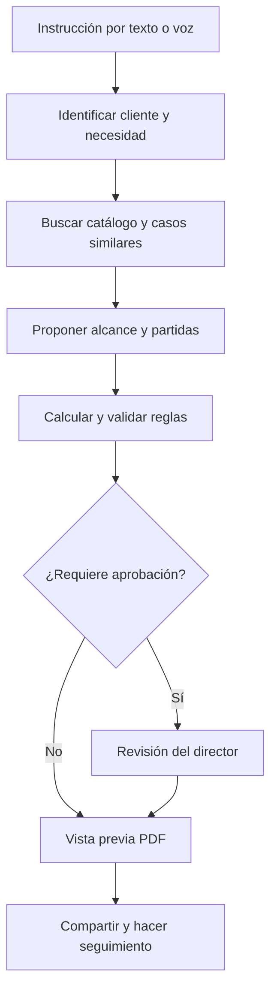
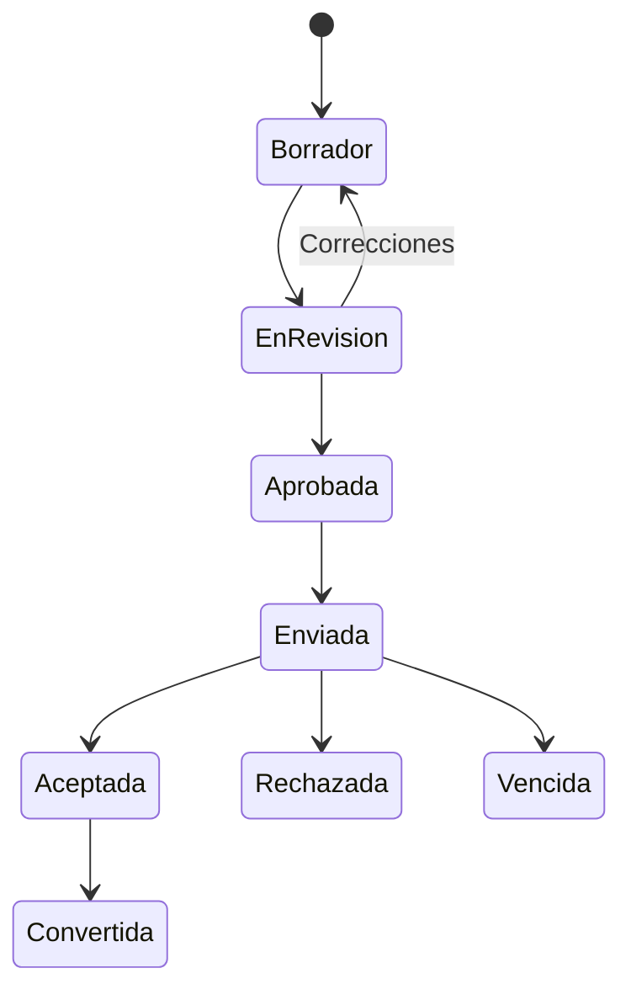
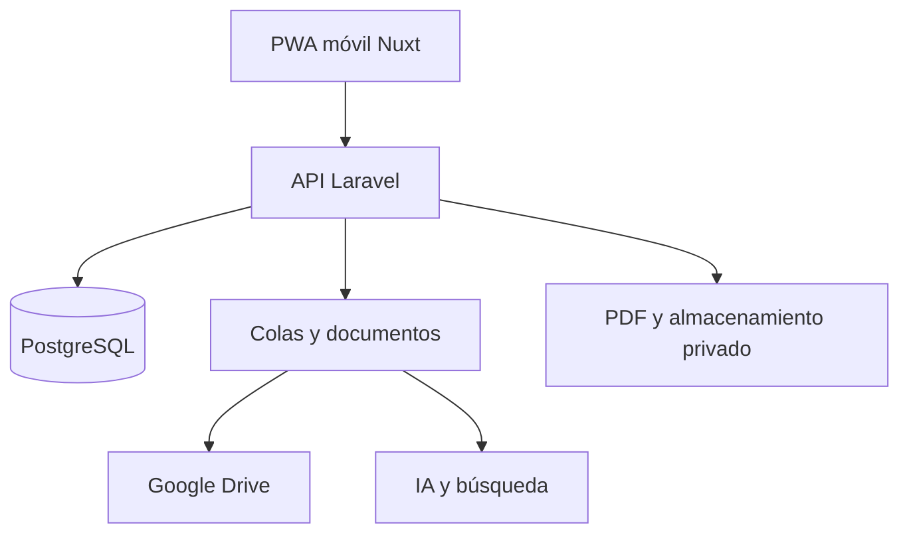

# Plan maestro — JARVIS Cotizador Systek

**Documento de trabajo para diseño, construcción y puesta en producción**  
**Fecha del levantamiento:** 18 de septiembre de 2026  
**Canal principal:** aplicación web móvil (PWA)  
**Fuente analizada:** carpeta `CLIENTES` de Google Drive, en modo de solo lectura

---

## 1. Resultado propuesto

Construir **JARVIS Cotizador Systek**, una aplicación móvil que permita pasar de una instrucción como:

> “Cotiza para este cliente 14 cámaras IP, instalación, mantenimiento del rack y pago 50/50”

a una propuesta comercial revisable, calculada, aprobada y lista para compartir en PDF.

La meta del MVP es que una cotización estándar pueda prepararse en **menos de 3 minutos**, sin copiar documentos anteriores y sin dejar que la inteligencia artificial decida precios, impuestos o totales por su cuenta.

### Decisión central

No conviene entrenar un modelo propio con estos archivos en la primera etapa. El historial es valioso, pero contiene precios antiguos, duplicados, información incompleta y textos heredados incorrectos. La solución inicial será:

- **Base transaccional:** clientes, sedes, catálogo, costos, precios, impuestos, márgenes y cotizaciones.
- **Conocimiento recuperable:** cotizaciones históricas de Drive, indexadas y consultables por similitud.
- **IA estructurada:** interpreta la solicitud, encuentra antecedentes y propone alcance, partidas, observaciones y preguntas faltantes.
- **Motor determinista:** recalcula dinero, valida reglas y genera el PDF.
- **Aprobación humana:** obligatoria antes de enviar cualquier propuesta.

---

## 2. Qué se encontró en Drive

### 2.1 Inventario inicial

| Elemento | Resultado observado |
| --- | ---: |
| Carpetas de clientes en el nivel principal | 49 |
| Archivos sueltos en el nivel principal | 2 |
| Registros poblados en `Hoja1` del maestro | 14 |
| Contactos en `INVITADOS SYSTEK` | 49, más el encabezado |
| PDF leídos de principio a fin para el muestreo | 7 |
| Carpetas empresariales revisadas en la muestra | 6 |

El archivo maestro contiene campos útiles —cliente, contacto, tipo, ciudad, dirección, zona, teléfono, servicios, última compra, observaciones y correo—, pero no representa toda la estructura encontrada en las carpetas.

### 2.2 Familias de cotización detectadas

| Familia | Ejemplos observados | Variables importantes |
| --- | --- | --- |
| CCTV | Cámaras IP, switches PoE, rack, cableado, instalación | Canales, resolución, metraje, tecnología, equipos reutilizados, garantía |
| Datos y potencia | UTP Cat6, jacks, canaleta, puntos eléctricos, mano de obra | Número de puestos/puntos, metros, canalización, materiales existentes |
| Equipos | Portátiles, PC, monitores | Especificación, marca, garantía, vigencia del costo, instalación |
| Software y licencias | Aplicación de control de tiempos, Office | Usuarios/equipos, alcance, instalación, renovación y soporte |
| UPS | Mantenimiento, baterías, puesta en marcha | Capacidad, cantidad de baterías, diagnóstico, garantía |
| Seguridad y renovaciones | Renovación Fortigate | Fecha de vencimiento, duración, serial, modalidad y proveedor |
| Servicios técnicos | Mantenimiento, reparación, configuración | Visita, diagnóstico, horas, repuestos, exclusiones |

En las cotizaciones revisadas aparecen pagos de contado y anticipos de 50 % o 60 %, garantías distintas por producto, valores expresados antes de IVA y renovaciones anuales. Estas reglas deben ser configurables por familia, no copiadas como texto libre.

### 2.3 Estructura común de los documentos

1. Identidad de la empresa y fecha.
2. Cliente, NIT, sede y contacto, cuando están disponibles.
3. Contexto o diagnóstico de la visita.
4. Alcance técnico propuesto.
5. Tabla de cantidad, descripción, valor unitario y total.
6. Total de la propuesta.
7. Observaciones, exclusiones, pago y garantía.
8. Datos de pago, despedida y firma.

Esta estructura se conservará, pero pasará a ser una plantilla versionada y controlada.

### 2.4 Problemas que debe corregir el sistema

| Hallazgo | Riesgo | Control propuesto |
| --- | --- | --- |
| 14 clientes en el maestro frente a 49 carpetas | Duplicados, clientes invisibles o datos desactualizados | Maestro único con NIT normalizado, contactos y sedes separados |
| Nombres distintos para un mismo cliente o sede | Historial fragmentado | Detección de posibles duplicados, sin fusionarlos automáticamente |
| Archivos DOCX/PDF duplicados y versiones `(1)` | No se sabe cuál fue enviada o aceptada | Número único y versiones inmutables |
| Precios históricos mezclados con precios vigentes | Cotizar con valores vencidos | Lista de precios versionada, fecha de costo y bloqueo por antigüedad |
| Totales sin desglose completo de subtotal, IVA y total final | Error comercial o tributario | Cálculo servidor, impuestos por línea y resumen explícito |
| Texto de garantía de cámaras en una propuesta de datos/potencia | Documento incoherente | Cláusulas por categoría y validador semántico antes de aprobar |
| Documentos históricos con otra razón social | Riesgo de marca y contractual | Lista de marcas prohibidas y membrete centralizado |
| Condiciones bancarias repetidas manualmente | Error sensible y difícil de actualizar | Configuración protegida, insertada después del paso de IA |
| No se observó vigencia en la muestra | Cliente puede aceptar un precio vencido | Vigencia obligatoria y vencimiento automático |
| No hay estado comercial ni trazabilidad central | Seguimientos manuales | Flujo borrador → aprobado → enviado → aceptado/rechazado/vencido |

---

## 3. Experiencia móvil

### 3.1 Pantallas del MVP

| Pantalla | Acción principal |
| --- | --- |
| Inicio | Ver pendientes, seguimientos y botón **Nueva cotización** |
| Hablar con JARVIS | Escribir o dictar la necesidad del cliente |
| Cliente | Buscar, confirmar sede/contacto o crear un prospecto |
| Borrador inteligente | Revisar alcance, partidas sugeridas y preguntas pendientes |
| Editor | Cambiar cantidades, precios permitidos, impuestos, descuento y condiciones |
| Validación | Ver errores, alertas, margen y aprobaciones requeridas |
| Vista previa | Revisar el PDF exactamente como lo recibirá el cliente |
| Compartir | Enlace seguro, correo, WhatsApp mediante compartir del dispositivo o descarga |
| Seguimiento | Registrar enviado, visto, aceptado, rechazado o vencido |

### 3.2 Flujo principal



### 3.3 Conversación de ejemplo

**Usuario:** “Nueva cotización para Bioproductos, sede Bello. Son ocho cámaras IP y mantenimiento del rack.”

**JARVIS:**

- Encontré el cliente y dos sedes. Confirmo: **Bello**.
- Hay antecedentes de CCTV y mantenimiento.
- Me faltan tres datos: tipo de cámara, metraje aproximado y forma de pago.
- Encontré precios históricos, pero no los usaré hasta validar la lista vigente.

Después de responder, JARVIS entrega un borrador estructurado. El usuario puede editarlo y enviarlo a aprobación.

---

## 4. Qué hará la IA y qué no hará

### 4.1 Funciones autorizadas para la IA

- Convertir texto o voz en una intención de cotización.
- Identificar cliente, sede, categoría y datos faltantes.
- Buscar cotizaciones similares y mostrar de dónde tomó el contexto.
- Proponer partidas existentes del catálogo, nunca inventar una referencia silenciosamente.
- Redactar diagnóstico, alcance, exclusiones y resumen ejecutivo.
- Comparar el borrador con documentos históricos.
- Detectar incoherencias, por ejemplo garantía de CCTV en un proyecto de potencia.
- Sugerir venta cruzada, marcada siempre como sugerencia.

### 4.2 Funciones que pertenecen al sistema

- Precio vigente, costo, margen y descuentos permitidos.
- Subtotal, impuestos, retenciones si aplican y total final.
- Número consecutivo, versión y estado de la cotización.
- Selección de cláusulas contractuales y datos bancarios.
- Permisos, aprobaciones, auditoría y emisión del PDF.
- Envío definitivo al cliente.

### 4.3 Contrato estructurado de la IA

La IA no devolverá un documento libre. Devolverá un objeto validable, por ejemplo:

```json
{
  "client_candidate_id": "uuid-or-null",
  "site_candidate_id": "uuid-or-null",
  "quote_family": "cctv",
  "scope_summary": "Instalación y puesta en marcha de CCTV IP",
  "suggested_lines": [
    {
      "catalog_item_id": "uuid-or-null",
      "description": "Cámara IP",
      "quantity": 8,
      "needs_price_validation": true
    }
  ],
  "missing_information": ["metraje", "forma_de_pago"],
  "source_document_ids": ["internal-id"],
  "confidence": 0.82
}
```

Se usará salida estructurada para exigir un esquema y llamadas de función para consultar datos o ejecutar acciones; esto coincide con la guía oficial de [Structured Outputs](https://developers.openai.com/api/docs/guides/structured-outputs). El historial podrá consultarse por búsqueda semántica y de palabras clave mediante una base vectorial o un índice equivalente; la alternativa administrada está documentada en [File Search](https://developers.openai.com/api/docs/guides/tools-file-search).

---

## 5. Reglas comerciales y bloqueos

### 5.1 Validaciones obligatorias

- Cliente o prospecto identificado.
- Ciudad/sede y contacto confirmados cuando el proyecto lo requiera.
- Una familia de cotización seleccionada.
- Todas las líneas con cantidad, unidad, precio y tratamiento tributario.
- Precio dentro de vigencia o aprobación especial.
- Margen mínimo cumplido o aprobación del director.
- Forma de pago, vigencia y garantía definidas.
- Alcance y exclusiones sin contradicciones.
- Marca, razón social, firma y datos de pago provenientes de configuración.
- Cálculo rehecho en el servidor antes de aprobar y antes de emitir.

### 5.2 Reglas que disparan aprobación

- Producto o servicio no registrado en catálogo.
- Precio modificado manualmente.
- Descuento superior al límite del rol.
- Margen inferior al mínimo configurado.
- Precio de proveedor vencido.
- Total superior al umbral definido por Systek.
- Condición de pago no estándar.
- Confianza de extracción de IA inferior al umbral.

### 5.3 Estados



Cada cambio posterior a la aprobación crea una nueva versión y exige una nueva aprobación cuando modifica dinero, alcance o condiciones.

---

## 6. Modelo de información

| Entidad | Propósito |
| --- | --- |
| `companies` | Datos legales, comerciales, membrete y firma de Systek |
| `users`, `roles`, `permissions` | Acceso para cotizador, técnico, aprobador y administrador |
| `clients` | Razón social, NIT normalizado, tipo y estado |
| `contacts` | Varias personas por cliente, con canal preferido |
| `sites` | Sedes, direcciones y zonas por cliente |
| `catalog_items` | Productos, servicios, licencias y paquetes |
| `supplier_costs` | Costos, proveedor, moneda y vigencia |
| `price_lists` y `price_list_versions` | Precio aprobado y trazabilidad histórica |
| `quote_families` | CCTV, datos/potencia, equipos, software, UPS, etc. |
| `templates` y `clauses` | Alcance, observaciones, exclusiones, garantía y pago |
| `quotes` | Cabecera, cliente, estado, vigencia y responsable |
| `quote_versions` | Copia inmutable de cada versión emitida |
| `quote_lines` | Cantidad, unidad, costo, precio, descuento, impuesto y total |
| `approvals` | Solicitud, decisión, motivo y responsable |
| `source_documents` | Metadatos, hash, ubicación y estado de importación desde Drive |
| `source_extractions` | Datos extraídos y confianza, sin volverlos vigentes automáticamente |
| `activities` | Envíos, seguimientos, respuestas y cambio de estado |
| `audit_logs` | Quién hizo qué, cuándo y desde dónde |

### Identificadores recomendados

- Cliente: NIT sin puntuación más dígito de verificación; los prospectos usan UUID hasta confirmar NIT.
- Cotización: `COT-AAAA-####`.
- Versión visible: `V1`, `V2`, etc.
- Documento final: `COT-2026-0123-V2-CLIENTE.pdf`.
- Dinero: COP con precisión decimal; nunca `float`.

---

## 7. Arquitectura propuesta

### 7.1 Componentes

- **Frontend:** Nuxt/Vue como PWA responsive, instalable en Android e iPhone.
- **Backend:** Laravel como API, reglas de negocio, permisos, generación documental y procesos en cola.
- **Base de datos:** PostgreSQL.
- **Colas y caché:** Redis.
- **Archivos:** almacenamiento privado compatible con S3, con enlaces temporales.
- **IA:** API de OpenAI con salidas estructuradas, herramientas y recuperación de antecedentes.
- **Documentos:** parser aislado para PDF, DOCX y XLSX; OCR solo cuando sea necesario.
- **Integración:** Google Drive con permiso mínimo de lectura durante la migración.



### 7.2 Integración con Drive

1. Autorizar únicamente lectura para el levantamiento e importación inicial.
2. Inventariar archivos por ID, carpeta, tipo, fecha, tamaño y hash.
3. Extraer datos sin sobrescribir la fuente.
4. Relacionar documentos con candidatos de cliente y sede.
5. Presentar duplicados y conflictos para revisión humana.
6. Guardar un token de sincronización para procesar cambios posteriores.

Google Drive permite buscar archivos/carpetas mediante `files.list` y filtrar por consultas, según su guía de [búsqueda de archivos](https://developers.google.com/workspace/drive/api/guides/search-files). Para una sincronización incremental, la colección de [cambios de Drive](https://developers.google.com/workspace/drive/api/guides/manage-changes) permite conservar un token y recuperar novedades en orden.

**Recomendación:** Drive continúa como archivo histórico durante el piloto. JARVIS será la fuente de verdad para las cotizaciones nuevas. La exportación automática de PDFs a Drive se agrega después de validar carpetas, permisos y nomenclatura.

---

## 8. Migración y construcción del conocimiento

### Fase A — Inventario

- Recorrer la carpeta autorizada y registrar metadatos.
- Separar clientes, documentos comerciales, contratos, facturas y anexos.
- Detectar duplicados exactos por hash y posibles duplicados por nombre/contenido.

### Fase B — Normalización de clientes

- Consolidar `Hoja1`, invitados y nombres de carpetas.
- Separar razón social, nombre comercial, contacto y sede.
- Normalizar NIT, teléfono, correo, ciudad y dirección.
- Proponer coincidencias con una puntuación y revisión humana.

### Fase C — Extracción de cotizaciones

- Identificar fecha, cliente, familia, partidas, cantidades, valores, pago y garantía.
- Guardar el texto fuente y la confianza por campo.
- Marcar cada precio como **histórico**, nunca como vigente.
- Enlazar DOCX y PDF que representen la misma versión.

### Fase D — Catálogo inicial

- Agrupar descripciones similares.
- Crear familias, unidades y paquetes reutilizables.
- Solicitar costo actual, proveedor, margen y vigencia.
- Publicar únicamente ítems aprobados por el administrador.

### Fase E — Base de conocimiento

- Indexar diagnóstico, alcance, exclusiones y observaciones aprobadas.
- Excluir datos bancarios y datos personales innecesarios del contexto enviado a IA.
- Conservar referencia al documento original para trazabilidad.

---

## 9. Seguridad y gobierno

- Inicio de sesión seguro, MFA para administradores y aprobadores.
- Roles y permisos por acción; el cotizador no cambia costos ni reglas globales.
- Acceso de Drive con el alcance mínimo y credenciales fuera del código.
- Cifrado en tránsito y en reposo.
- PDFs privados y enlaces temporales o protegidos.
- Registro de creación, cambios de precio, aprobación, descarga y envío.
- Datos bancarios y firma fuera del contexto de IA.
- Documentos importados tratados como contenido no confiable; sus instrucciones nunca se ejecutan.
- Copias de seguridad, restauración probada y política de retención.
- Confirmación explícita antes de compartir externamente.
- No usar datos de Systek para entrenar modelos sin una autorización separada y documentada.

---

## 10. Alcance del MVP

### Incluido

- Aplicación móvil instalable.
- Usuarios, roles y permisos básicos.
- Clientes, contactos y sedes.
- Catálogo y listas de precios versionadas.
- Familias y plantillas de cotización.
- Creación por formulario, texto y dictado del dispositivo.
- Asistente para alcance, antecedentes y datos faltantes.
- Cálculos server-side, descuentos, impuestos configurables y margen.
- Aprobación simple.
- PDF versionado.
- Compartir desde el celular y registrar el envío.
- Seguimientos y vencimientos.
- Importación inicial de Drive con revisión de coincidencias.
- Auditoría mínima y tablero comercial.

### Después del MVP

- Integración oficial con WhatsApp Business para envío y lectura de respuestas.
- Firma o aceptación digital del cliente.
- Conversión a orden de trabajo, compra o factura.
- Portal del cliente.
- Solicitud automática de precios a proveedores.
- Renovaciones recurrentes y contratos.
- Rentabilidad real contra costos de ejecución.
- Operación sin conexión avanzada.
- Fine-tuning, solo si las correcciones aprobadas demuestran una mejora medible frente a recuperación y reglas.

---

## 11. Plan de entrega indicativo

| Etapa | Duración estimada | Entregable |
| --- | ---: | --- |
| 0. Definición y datos | 3–5 días | Reglas, marca, usuarios, muestra validada y catálogo inicial |
| 1. Núcleo comercial | 1–2 semanas | Acceso, clientes, sedes, catálogo y precios |
| 2. Cotizador | 1–2 semanas | Editor móvil, motor de cálculo, plantillas y PDF |
| 3. JARVIS e importación | 1–2 semanas | Asistente estructurado, antecedentes e ingestión de Drive |
| 4. Aprobaciones y piloto | 1 semana | Flujos, seguimiento, QA, seguridad y piloto controlado |

**Rango total orientativo:** 5 a 7 semanas para un MVP piloto. La duración real depende del volumen de documentos, calidad del catálogo vigente y reglas de aprobación.

### Orden recomendado de construcción

1. Base de datos y reglas de dinero.
2. Catálogo y precios vigentes.
3. Editor móvil y PDF.
4. Importador histórico.
5. Asistente de IA.
6. Aprobaciones, envío y seguimiento.

Este orden permite probar la exactitud comercial antes de automatizar la redacción.

---

## 12. Criterios de aceptación del piloto

- Crear desde el celular una cotización estándar en menos de 3 minutos.
- Cálculos monetarios reproducibles y cubiertos por pruebas automatizadas.
- Imposibilidad de emitir con precio vencido, total inconsistente o campo obligatorio faltante.
- PDF con una sola marca, cláusulas coherentes, vigencia y versión visibles.
- Reproducir las siete cotizaciones de muestra usando datos estructurados, sin copiar el documento completo.
- Detectar candidatos duplicados entre el maestro, invitados y carpetas, sin fusionarlos automáticamente.
- Mostrar la fuente de cada sugerencia histórica de JARVIS.
- Registrar quién creó, modificó, aprobó, emitió y compartió cada versión.
- Mantener aprobación humana antes del envío.
- Funcionar correctamente en pantallas móviles comunes.

### Indicadores del primer mes

- Tiempo medio desde “Nueva cotización” hasta “Lista para enviar”.
- Porcentaje de cotizaciones aprobadas sin correcciones.
- Número de errores bloqueados antes de emitir.
- Porcentaje enviado, aceptado, rechazado y vencido.
- Días promedio de seguimiento.
- Margen promedio por familia.
- Porcentaje de sugerencias de IA aceptadas, modificadas o descartadas.

---

## 13. Decisiones pendientes antes de programar precios reales

| Decisión | Valor provisional recomendado |
| --- | --- |
| Marca emisora | Solo Systek Company S.A.S. |
| Moneda inicial | COP |
| Tratamiento tributario | Configurable por línea y revisado con contabilidad |
| Vigencia estándar | 15 días, configurable |
| Envío automático | Desactivado; siempre vista previa y confirmación |
| Precios históricos | Solo referencia, nunca activos |
| Precio vencido | Bloquea emisión y solicita actualización/aprobación |
| Aprobación | Por excepción: margen, descuento, precio vencido, ítem nuevo o monto alto |
| Drive durante el piloto | Lectura e importación; sin mover ni borrar archivos |
| Canal inicial | Compartir móvil/PDF; WhatsApp Business directo en fase posterior |

Para cerrar estas reglas se requiere confirmar:

1. Datos legales, membrete, firma y cláusulas oficiales vigentes de Systek.
2. Quién cotiza, quién administra precios y quién aprueba excepciones.
3. Fuente actual de costos y margen mínimo por familia.
4. Reglas tributarias y retenciones con contabilidad.
5. Vigencia, garantías y pagos estándar por cada familia.

---

## 14. Primera iteración que debe construirse

La primera entrega funcional debe cubrir un caso completo y frecuente: **cotización de CCTV desde el celular**.

Debe permitir:

1. Seleccionar un cliente y sede.
2. Indicar por texto o voz número de cámaras, tecnología, metraje y servicios.
3. Recuperar antecedentes similares.
4. Elegir partidas aprobadas del catálogo.
5. Calcular subtotal, impuestos y total.
6. Añadir alcance, exclusiones, pago, garantía y vigencia.
7. Validar margen, coherencia y datos obligatorios.
8. Solicitar aprobación cuando corresponda.
9. Generar la versión PDF.
10. Compartirla desde el celular y programar seguimiento.

Cuando este flujo sea confiable, se reutiliza el mismo núcleo para datos/potencia, equipos, software, UPS, licencias y renovaciones.

---

## Conclusión

Los documentos actuales sí permiten construir un JARVIS útil, pero su mayor valor no está en “entrenar una IA” con todo el Drive. Está en convertir el conocimiento histórico en antecedentes consultables y trasladar las decisiones sensibles a datos, reglas y aprobaciones controladas.

El MVP recomendado reduce el tiempo de cotización sin sacrificar exactitud: la IA entiende y redacta; el sistema calcula y gobierna; una persona autoriza el envío.
